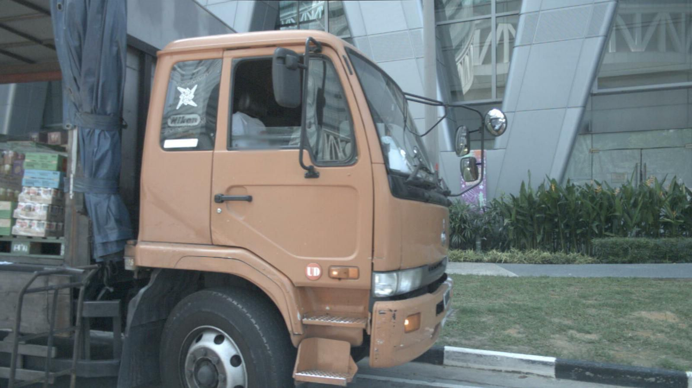
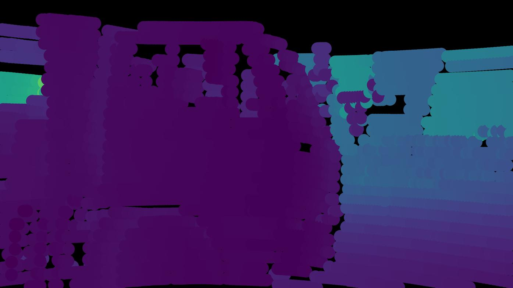
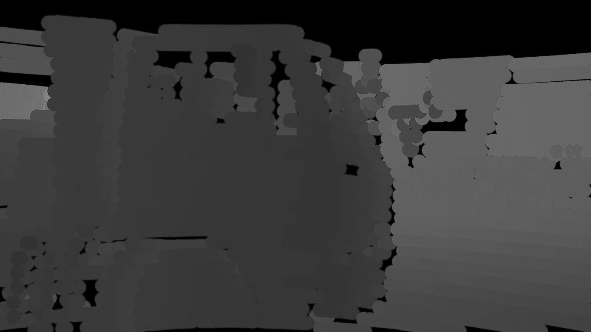

# Nuscenes-Lidar-to-Depth-Image
This repository contains the code for transforming lidar point cloud provided by nuscenes dataset to depth images. Some part of the code are borrowed from [nuscenes-devkit](https://github.com/nutonomy/nuscenes-devkit).

Examples of the output depth images:

Camera image (for reference):

  
 
RGB depth image of lidar projected on left back camera:
 
 
Grayscale depth image of lidar projected on left back camera:
 
 
Note: nuscenes/python_sdk folder is the [nuscenes-devkit](https://github.com/nutonomy/nuscenes-devkit) with some extra functions to transform the Lidar point cloud to depth image.
